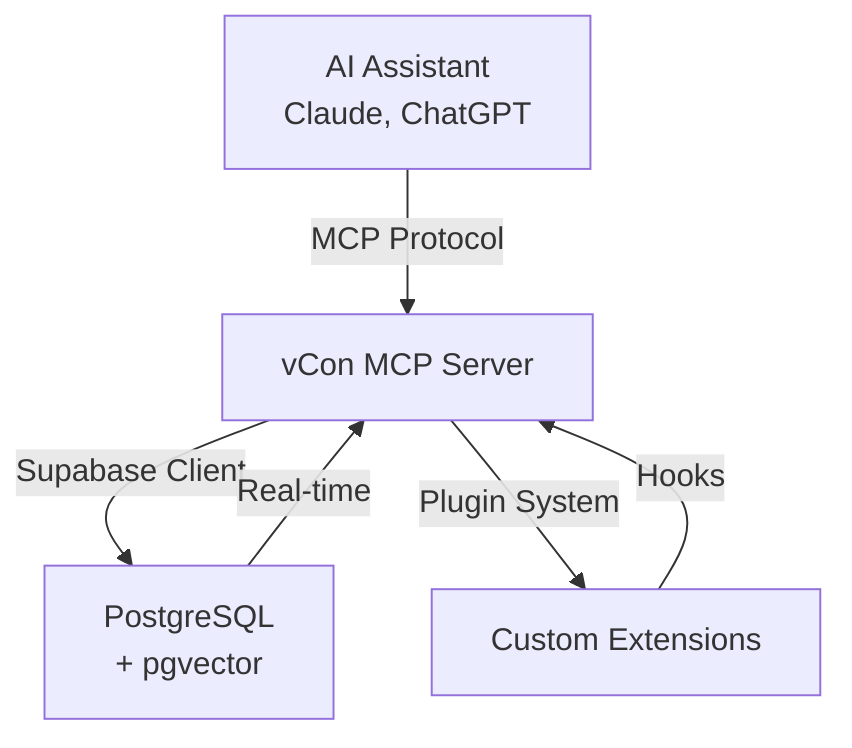

## Quick Start

::: code-group

```bash [npm]
npm install @vcon/mcp-server
```

```bash [yarn]
yarn add @vcon/mcp-server
```

```bash [pnpm]
pnpm add @vcon/mcp-server
```

:::

## What is vCon?

vCon (Virtual Conversation) is an IETF standard for representing conversations in a portable, interoperable format. Think of it as "PDF for conversations" - a standardized container for:

- **Conversations** from any medium (voice, video, text, email)
- **Participants** with identity and privacy controls
- **AI Analysis** from transcription, sentiment, summarization
- **Attachments** like documents, images, or related files
- **Privacy markers** for consent and redaction

## What is MCP?

The Model Context Protocol (MCP) enables AI assistants to use external tools and data sources. This server implements MCP to give AI assistants the ability to create, search, analyze, and manage conversation data.

## Features at a Glance

### Core Capabilities

- ✅ **15+ MCP Tools** - Complete CRUD operations, search, tagging, templates
- ✅ **9 Query Prompts** - Guide AI assistants to search effectively
- ✅ **4 Search Modes** - Basic, keyword, semantic, and hybrid search
- ✅ **Tag System** - Flexible key-value metadata for organization
- ✅ **Database Tools** - Inspection, performance monitoring, optimization
- ✅ **Plugin System** - Extensible architecture for custom features
- ✅ **Type-Safe** - Full TypeScript with Zod validation
- ✅ **Spec-Compliant** - Follows IETF vCon specification exactly

### Use Cases

**Contact Centers**
- Capture and analyze customer calls
- Generate automatic transcripts
- Track agent performance
- Maintain compliance audit trails

**Sales Teams**
- Record sales conversations
- Extract action items
- Analyze conversation patterns
- Generate meeting summaries

**Research**
- Collect conversation datasets
- Analyze communication patterns
- Build ML training data
- Generate insights from dialogue

**Compliance & Legal**
- Maintain conversation archives
- Apply redaction for privacy
- Track consent and permissions
- Generate audit reports

## Architecture



## Example Usage

### With Claude Desktop

```json
{
  "mcpServers": {
    "vcon": {
      "command": "node",
      "args": ["/path/to/vcon-mcp/dist/index.js"],
      "env": {
        "SUPABASE_URL": "your-project-url",
        "SUPABASE_ANON_KEY": "your-anon-key"
      }
    }
  }
}
```

Then ask Claude:
- "Search for conversations about billing issues"
- "Create a vCon for a customer support call"
- "Find all high-priority sales conversations from last week"

### Programmatic Usage

```typescript
import { VConQueries } from '@vcon/mcp-server';
import { createClient } from '@supabase/supabase-js';

const supabase = createClient(url, key);
const queries = new VConQueries(supabase);

// Create a vCon
const vcon = await queries.createVCon({
  vcon: '0.3.0',
  uuid: crypto.randomUUID(),
  created_at: new Date().toISOString(),
  subject: 'Customer Support Call',
  parties: [
    { name: 'Agent', mailto: 'agent@example.com' },
    { name: 'Customer', tel: '+1-555-0100' }
  ]
});

// Search vCons
const results = await queries.searchVCons({
  subject: 'billing',
  limit: 10
});
```

## Community & Support

- 📧 [GitHub Issues](https://github.com/vcon-mcp/issues) - Bug reports & feature requests
- 💬 [GitHub Discussions](https://github.com/vcon-mcp/discussions) - Community discussions
- 📚 [Documentation](https://mcp.conserver.io/) - Complete guides and reference
- 🌐 [IETF vCon Working Group](https://datatracker.ietf.org/wg/vcon/) - Specification development

## License

Released under the [MIT License](https://github.com/vcon-mcp/blob/main/LICENSE).

## Acknowledgments

- **IETF vCon Working Group** for the specification
- **Anthropic** for the Model Context Protocol
- **Supabase** for the PostgreSQL platform
- **Contributors** who helped build this project

